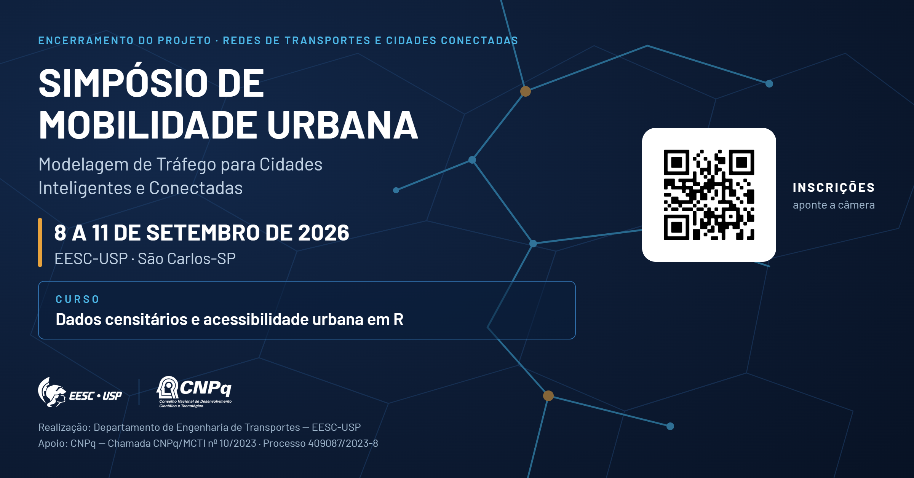

::: {.hero}
{fig-alt="Simpósio de Mobilidade Urbana — Modelagem de Tráfego para Cidades Inteligentes e Conectadas. 8 a 11 de setembro de 2026, EESC-USP, São Carlos-SP."}

::: {.hero-cta}
::: {.meta}
**8 a 11 de setembro de 2026** · EESC-USP, São Carlos-SP 
Participação gratuita · vagas limitadas para o curso de 9/set
:::
[Inscreva-se](https://forms.gle/HFRWbrasoC7TqyaT8){.btn-simposio target="_blank"}
[Ver programação](programacao.qmd){.btn-simposio-ghost}
:::
:::

## O evento

O simpósio encerra o projeto **"Repensando a modelagem de tráfego em redes de transportes para a nova geração de cidades inteligentes e conectadas"** (Processo CNPq nº 409087/2023-8, Chamada CNPq/MCTI nº 10/2023 — Faixa B, Grupos Consolidados).

São quatro dias em que a equipe do projeto — pesquisadores de sete instituições — apresenta os resultados obtidos entre 2023 e 2026 e discute a agenda que se abre a partir deles. O programa combina **palestras técnicas**, um **curso prático de dia inteiro em R** e **sessões de trabalho** do grupo de pesquisa.

::: {.cards}
::: {.card-s .destaque}
#### Curso prático em R

**Dados censitários e acessibilidade urbana em R** — dia inteiro em 9/set, quatro módulos alternando teoria e prática. Vagas limitadas.
:::

::: {.card-s}
#### Palestras técnicas

Emissões de GEE, microssimulação com realidade virtual, veículos autônomos e validade estatística de resultados de simulação.
:::

::: {.card-s}
#### Resultados do projeto

Três anos de pesquisa em modelagem de tráfego em escala de rede, apresentados pelos próprios autores.
:::
:::

## Para quem é

Estudantes de graduação e pós-graduação, pesquisadores, docentes e profissionais de órgãos públicos, concessionárias e empresas que trabalham com engenharia de tráfego, planejamento de transportes e sistemas inteligentes de transportes.

## Quando e onde

| | |
|---|---|
| **Datas** | 8 a 11 de setembro de 2026 (terça a sexta) |
| **Local** | Escola de Engenharia de São Carlos — USP, São Carlos-SP |
| **Realização** | Departamento de Engenharia de Transportes — EESC-USP |
| **Inscrição** | Gratuita, pelo [formulário on-line](https://forms.gle/HFRWbrasoC7TqyaT8) |
| **Contato** | [alcunha@usp.br](mailto:alcunha@usp.br) |

: {.striped tbl-colwidths="[22,78]"}

::: {.callout-note appearance="simple"}
A programação detalhada está em [Programação](programacao.qmd); as sínteses dos convidados, em [Palestrantes](palestrantes.qmd); e os arquivos para download, em [Materiais](materiais.qmd).
:::
