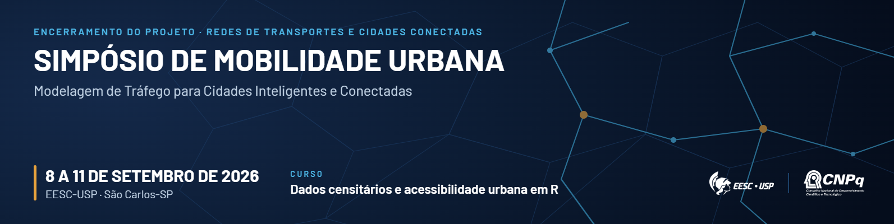

# Simpósio de Mobilidade Urbana

### Modelagem de Tráfego para Cidades Inteligentes e Conectadas

**8 a 11 de setembro de 2026** · EESC-USP · São Carlos-SP
Participação gratuita · vagas limitadas para o curso de 9/set

### ➜ **[Faça sua inscrição](https://forms.gle/tNbCwFhj6etKFCQH7)**

---

## O evento

O simpósio encerra o projeto **"Repensando a modelagem de tráfego em redes de transportes para a nova geração de cidades inteligentes e conectadas"** (Processo CNPq nº 409087/2023-8 — Chamada CNPq/MCTI nº 10/2023, Faixa B, Grupos Consolidados).

São quatro dias em que a equipe do projeto — pesquisadores de sete instituições — apresenta os resultados obtidos entre 2023 e 2026 e discute a agenda que se abre a partir deles. O programa combina **palestras técnicas**, um **curso prático de dia inteiro em R** e **sessões de trabalho** do grupo de pesquisa.

| | |
|---|---|
| **Curso prático em R** | *Dados censitários e acessibilidade urbana em R* — dia inteiro em 9/set, quatro módulos alternando teoria e prática. Vagas limitadas. |
| **Palestras técnicas** | Emissões de GEE, microssimulação com realidade virtual, veículos autônomos e validade estatística de resultados de simulação. |
| **Resultados do projeto** | Três anos de pesquisa em modelagem de tráfego em escala de rede, apresentados pelos próprios autores. |

### Para quem é

Estudantes de graduação e pós-graduação, pesquisadores, docentes e profissionais de órgãos públicos, concessionárias e empresas que trabalham com engenharia de tráfego, planejamento de transportes e sistemas inteligentes de transportes.

### Quando e onde

| | |
|---|---|
| **Datas** | 8 a 11 de setembro de 2026 (terça a sexta) |
| **Local** | Escola de Engenharia de São Carlos — USP, São Carlos-SP |
| **Realização** | Departamento de Engenharia de Transportes — EESC-USP |
| **Inscrição** | Gratuita, pelo [formulário on-line](https://forms.gle/tNbCwFhj6etKFCQH7) |
| **Contato** | [alcunha@usp.br](mailto:alcunha@usp.br) |

---

## Programação

Grade preliminar, sujeita a ajustes até a véspera do evento. Os intervalos de *coffee break* são também os momentos de conversa entre as equipes — estão na grade de propósito.

| Horário | 8/set · terça | 9/set · quarta | 10/set · quinta | 11/set · sexta |
|:--|:--|:--|:--|:--|
| **8h00–9h30** | — | **Dados censitários · teoria** Jorge Ubirajara (UFBA), Thiago Louro e Lucas Brandão (EESC) | **Emissões de GEE em simulação** Flávio Vaz (EESC-USP) | 🔒 **Reunião de fechamento** Grupo de pesquisa |
| *Coffee break* | | | | |
| **10h00–12h00** | **Chegada dos convidados** Recepção no aeroporto | **Dados censitários · prática em R** Jorge Ubirajara (UFBA), Thiago Louro e Lucas Brandão (EESC) | **Microssimulação e realidade virtual** Felipe Caleffi (UFSM) | 🔒 **Perspectivas futuras** Planejamento de artigos |
| *Almoço* | | | | |
| **14h00–15h30** | ★ **Abertura do evento** Recepção dos convidados | **Acessibilidade urbana · teoria** Jorge Ubirajara (UFBA), Thiago Louro e Lucas Brandão (EESC) | **Veículos autônomos no meio urbano** José Elievam (UFMG) | — |
| *Coffee break* | | | | |
| **16h00–18h00** | **Tutorial de replicações e validade estatística** Rodrigo Castelan (UFSC) | **Acessibilidade urbana · prática em R** Jorge Ubirajara (UFBA), Thiago Louro e Lucas Brandão (EESC) | **Resultados e fechamento do projeto** André Luiz Cunha (EESC-USP) | — |

> **Legenda.** 🔒 atividades internas do grupo de pesquisa · ★ abertura oficial · — sem atividade programada.

### Os quatro dias em uma frase cada

- **8/set (terça)** — chegada e recepção dos convidados pela manhã, abertura à tarde e, no fim do dia, o tutorial de replicações e validade estatística com Rodrigo Castelan (UFSC).
- **9/set (quarta)** — dia inteiro dedicado ao curso *Dados censitários e acessibilidade urbana em R*, em quatro módulos que alternam teoria e prática.
- **10/set (quinta)** — dia das apresentações de resultados: emissões de GEE, microssimulação com realidade virtual, veículos autônomos e o fechamento com os resultados da EESC-USP.
- **11/set (sexta)** — sessões internas: reunião de fechamento do grupo e planejamento dos artigos decorrentes do projeto.

---

## Palestrantes

O simpósio reúne pesquisadores de sete instituições — EESC-USP, EPUSP, UFMG, UFRJ, UFSC, UFSM e UFBA — que integraram a equipe do projeto entre 2023 e 2026.

### Palestras e sessões técnicas

**Prof. Dr. Rodrigo Castelan Carlson** — *UFSC*
Pesquisador em controle e automação aplicados a sistemas de tráfego. No simpósio, trata do problema prático que antecede toda conclusão obtida por simulação: quantas replicações são necessárias para que o resultado seja estatisticamente defensável.
**Tema:** Tutorial de número de replicações e validade estatística de resultados de microssimulação. · `8/set · 16h00–18h00`

**Prof. Dr. Flávio Guilherme Vaz de Almeida Filho** — *EESC-USP*
Membro da equipe do projeto. Confronta três fontes de estimativa de emissões de gases de efeito estufa — ensaio laboratorial, medição em via e modelo de simulação — e discute o que cada uma consegue (e não consegue) responder.
**Tema:** Estimativas de emissões de GEE no laboratório, no mundo real e em simulações. · `10/set · 8h00–9h30`

**Prof. Dr. Felipe Caleffi** — *UFSM*
Membro da equipe do projeto. Apresenta o acoplamento entre microssimulação e realidade virtual como instrumento de avaliação de intervenções urbanas, além do panorama das aplicações desenvolvidas por seus orientandos na UFSM.
**Tema:** Integração de microssimulador de tráfego e realidade virtual com foco em replanejamento urbano; trabalhos de conclusão de curso da UFSM com aplicações de microssimulação. · `10/set · 10h00–12h00`

**Prof. Dr. José Elievam Bessa Júnior** — *UFMG*
Membro da equipe do projeto. Discute como a introdução de veículos autônomos altera o desempenho de redes urbanas, a partir de cenários de simulação construídos ao longo do projeto.
**Tema:** Impacto de veículos autônomos no meio urbano por meio de simulação de tráfego: resultados e perspectivas futuras. · `10/set · 14h00–15h30`

**Prof. Dr. André Luiz Barbosa Nunes da Cunha** — *EESC-USP · coordenação*
Coordenador do projeto. Consolida os resultados obtidos entre 2023 e 2026 pelo Departamento de Engenharia de Transportes da EESC-USP e abre a discussão sobre a agenda de pesquisa que se segue ao encerramento.
**Tema:** Resultados das pesquisas EESC-USP e fechamento do projeto. · `10/set · 16h00–18h00`

### Curso — Dados censitários e acessibilidade urbana em R

Curso de dia inteiro (9/set), em quatro módulos alternando teoria e prática em R. Vagas limitadas.

**Prof. Dr. Jorge Ubirajara Pedreira Junior** — *UFBA*
Conduz os módulos que ligam a base censitária brasileira às medidas de acessibilidade urbana, do tratamento dos setores censitários ao cálculo de indicadores em R.

**Dr. Thiago Vinicius Louro** — *EESC-USP*
Responsável, junto com a equipe, pela parte prática do curso: manipulação de dados, cálculo de indicadores e visualização dos resultados em R.

**Dr. Lucas Brandão Monteiro de Assis** — *EESC-USP*
Atua nos módulos práticos, com foco na reprodutibilidade das rotinas e na aplicação dos indicadores a estudos de caso.

### Equipe do projeto

Pesquisadores da equipe que participam das sessões de discussão e da reunião de fechamento.

- **Prof. Dr. Claudio Luiz Marte** — *EPUSP* · interface entre sistemas inteligentes de transportes e infraestrutura viária.
- **Prof. Dr. José Reynaldo Anselmo Setti** — *EESC-USP* · atuação de longa data em modelagem e simulação de tráfego.
- **Profa. Dra. Marina Leite de Barros Baltar** — *UFRJ* · análise de redes e mobilidade urbana.

---

## Inscrição

A participação é **gratuita**. O curso do dia 9 de setembro tem **vagas limitadas** e a seleção segue a ordem de inscrição.

### ➜ **[https://forms.gle/tNbCwFhj6etKFCQH7](https://forms.gle/tNbCwFhj6etKFCQH7)**

---

## Materiais

### Programação e divulgação

| Arquivo | Formato | Uso |
|:--|:--|:--|
| [Programação completa](materiais/programacao-simposio-mobilidade.pdf) | PDF | Grade em texto, para impressão e anexo em pedidos de afastamento |
| [Programação diagramada](materiais/programacao-arte.pdf) | PDF | Versão em arte, para divulgação |
| [Grade em imagem](images/programacao.png) | PNG | Para compartilhar em mensagens e redes sociais |
| [Banner do simpósio](materiais/banner-divulgacao.png) | PNG | Peça horizontal com QR Code — e-mail, apresentações e murais |

### Material das sessões

Slides, códigos e dados são publicados aqui **após cada sessão**. Os módulos do curso em R vêm com os scripts e as bases usadas em aula.

| Sessão | Responsáveis | Status |
|:--|:--|:--|
| Curso: Dados censitários e acessibilidade urbana em R (9/set) | Jorge Ubirajara (UFBA), Thiago Louro e Lucas Brandão (EESC-USP) | *Em breve* |
| Tutorial de replicações e validade estatística (8/set) | Rodrigo Castelan (UFSC) | *Em breve* |
| Emissões de GEE: laboratório, mundo real e simulação (10/set) | Flávio Vaz (EESC-USP) | *Em breve* |
| Microssimulação de tráfego e realidade virtual (10/set) | Felipe Caleffi (UFSM) | *Em breve* |
| Veículos autônomos no meio urbano (10/set) | José Elievam (UFMG) | *Em breve* |
| Resultados EESC-USP e fechamento do projeto (10/set) | André Luiz Cunha (EESC-USP) | *Em breve* |

> Para publicar um material, coloque o arquivo em `materiais/` e troque *Em breve* por um link — ou aponte para o repositório/DOI onde o material já esteja depositado.

---

## Sobre o projeto

**"Repensando a modelagem de tráfego em redes de transportes para a nova geração de cidades inteligentes e conectadas"**
Processo CNPq nº 409087/2023-8 — Chamada CNPq/MCTI nº 10/2023, Faixa B (Grupos Consolidados).
Coordenação: Prof. Dr. André Luiz Barbosa Nunes da Cunha — Departamento de Engenharia de Transportes, EESC-USP.

### Pendências antes da divulgação ampla

- **Sínteses dos palestrantes** foram redigidas a partir das cartas-convite e da programação. Confirmar títulos, vínculos e recorte de pesquisa com cada convidado.
- **Vínculo de Flávio Vaz**: a carta-convite traz EESC-USP; o flier da arte final traz EPUSP. Este documento segue a carta. Definir qual está correto e alinhar as duas peças.
- **Instituições de Thiago Louro e Lucas Assis** não constavam da proposta; aqui registradas como EESC-USP, seguindo o flier. Confirmar.
- **Local exato** (auditório/sala) e informações de hospedagem e deslocamento em São Carlos ainda não constam.
- **Marca do CNPq**: item 3.2 do Termo de Outorga pede consulta prévia à comunicação social do CNPq (comunicacao@cnpq.br) sobre os padrões de aplicação.

---

&nbsp;&nbsp;&nbsp;&nbsp;

**Realização:** Departamento de Engenharia de Transportes — EESC-USP
**Apoio:** CNPq — Chamada CNPq/MCTI nº 10/2023 · Processo 409087/2023-8

Dúvidas e contato: [alcunha@usp.br](mailto:alcunha@usp.br)

