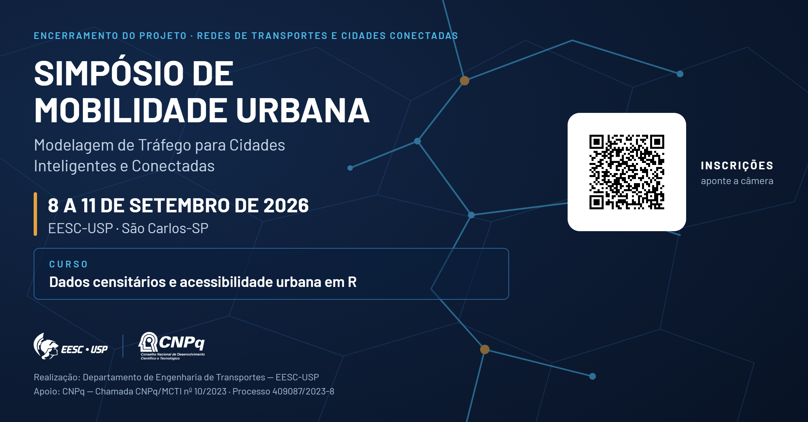
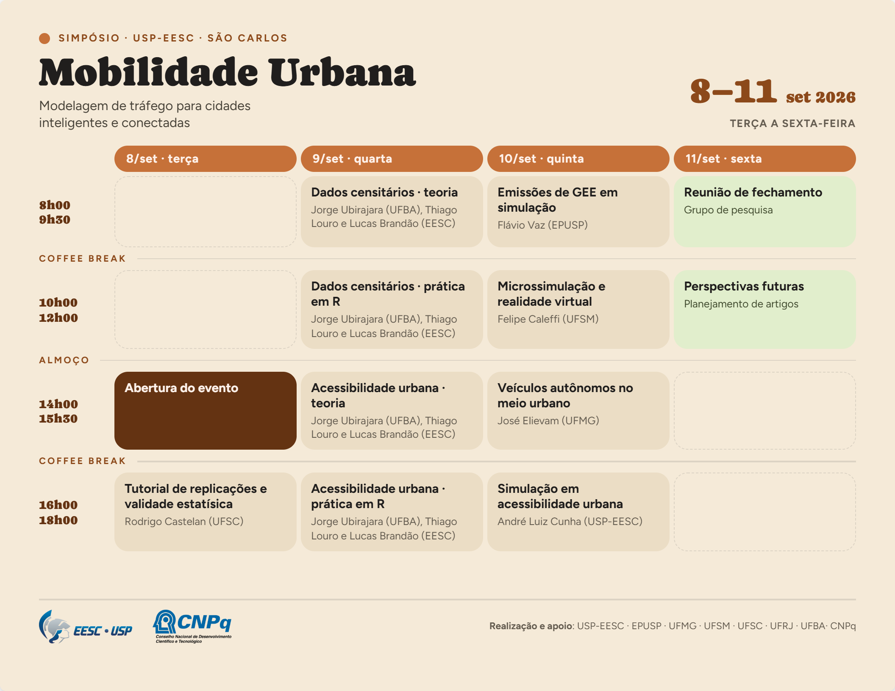

# Simpósio de Mobilidade Urbana

### Modelagem de Tráfego para Cidades Inteligentes e Conectadas

**8 a 11 de setembro de 2026** · EESC-USP · São Carlos-SP
Participação gratuita · vagas limitadas para o curso de 9/set

### ➜ **[Faça sua inscrição](https://forms.gle/tNbCwFhj6etKFCQH7)**

---

## O evento

O simpósio encerra o projeto **"Repensando a modelagem de tráfego em redes de transportes para a nova geração de cidades inteligentes e conectadas"** (Processo CNPq nº 409087/2023-8 — Chamada CNPq/MCTI nº 10/2023, Faixa B, Grupos Consolidados).

São quatro dias em que a equipe do projeto — pesquisadores de cinco instituições — apresenta os resultados obtidos entre 2023 e 2026 e discute a agenda que se abre a partir deles. O programa combina **palestras** e um **curso prático em R** do grupo de pesquisa.

| | |
|---|---|
| **Curso prático em R** | *Dados censitários e acessibilidade urbana em R* — dia inteiro em 9/set, quatro módulos alternando teoria e prática. Vagas limitadas. |
| **Palestras** | Emissões de GEE, microssimulação com realidade virtual, veículos autônomos e validade estatística de resultados de simulação. |

### Para quem é

Estudantes de graduação e pós-graduação, pesquisadores, docentes e profissionais de órgãos públicos, concessionárias e empresas que trabalham com engenharia de tráfego, planejamento de transportes e sistemas inteligentes de transportes.

### Quando e onde

| | |
|---|---|
| **Datas** | 8 a 11 de setembro de 2026 (terça a sexta) |
| **Local** | Escola de Engenharia de São Carlos — USP, São Carlos-SP |
| **Realização** | Departamento de Engenharia de Transportes — EESC-USP |
| **Inscrição** | Gratuita, pelo [formulário on-line](https://forms.gle/tNbCwFhj6etKFCQH7) |
| **Contato** | [alcunha@usp.br](mailto:alcunha@usp.br) |

---

## Programação

---

## Palestrantes

O simpósio reúne pesquisadores de cinco instituições — USP (EESC e EP), UFMG, UFRJ, UFSC e UFSM — que integraram a equipe do projeto entre 2023 e 2026. Além da participação especial do **prof. Jorge Ubirajara** (UFBA) que ministrará o curso em R - desenvolvedor de pacotes em R, como o [`cnefetools`](https://pedreirajr.github.io/cnefetools/), e autor do livro [Censo Demográfico em R](https://pedreirajr.github.io/rcensolivro/).

<!--
### Palestras e sessões técnicas

**Prof. Dr. Rodrigo Castelan Carlson** — *UFSC*
Pesquisador em controle e automação aplicados a sistemas de tráfego. No simpósio, trata do problema prático que antecede toda conclusão obtida por simulação: quantas replicações são necessárias para que o resultado seja estatisticamente defensável.
**Tema:** Tutorial de número de replicações e validade estatística de resultados de microssimulação. · `8/set · 16h00–18h00`

**Prof. Dr. Flávio Guilherme Vaz de Almeida Filho** — *EESC-USP*
Membro da equipe do projeto. Confronta três fontes de estimativa de emissões de gases de efeito estufa — ensaio laboratorial, medição em via e modelo de simulação — e discute o que cada uma consegue (e não consegue) responder.
**Tema:** Estimativas de emissões de GEE no laboratório, no mundo real e em simulações. · `10/set · 8h00–9h30`

**Prof. Dr. Felipe Caleffi** — *UFSM*
Membro da equipe do projeto. Apresenta o acoplamento entre microssimulação e realidade virtual como instrumento de avaliação de intervenções urbanas, além do panorama das aplicações desenvolvidas por seus orientandos na UFSM.
**Tema:** Integração de microssimulador de tráfego e realidade virtual com foco em replanejamento urbano; trabalhos de conclusão de curso da UFSM com aplicações de microssimulação. · `10/set · 10h00–12h00`

**Prof. Dr. José Elievam Bessa Júnior** — *UFMG*
Membro da equipe do projeto. Discute como a introdução de veículos autônomos altera o desempenho de redes urbanas, a partir de cenários de simulação construídos ao longo do projeto.
**Tema:** Impacto de veículos autônomos no meio urbano por meio de simulação de tráfego: resultados e perspectivas futuras. · `10/set · 14h00–15h30`

**Prof. Dr. André Luiz Barbosa Nunes da Cunha** — *EESC-USP · coordenação*
Coordenador do projeto. Consolida os resultados obtidos entre 2023 e 2026 pelo Departamento de Engenharia de Transportes da EESC-USP e abre a discussão sobre a agenda de pesquisa que se segue ao encerramento.
**Tema:** Resultados das pesquisas EESC-USP e fechamento do projeto. · `10/set · 16h00–18h00`

--> 

### Curso — Dados censitários e acessibilidade urbana em R

Curso de dia inteiro (9/set), em quatro módulos alternando teoria e prática em R. Vagas limitadas.

**Prof. Dr. Jorge Ubirajara Pedreira Junior** — *UFBA*
Conduz os módulos que ligam a base censitária brasileira às medidas de acessibilidade urbana, do tratamento dos setores censitários ao cálculo de indicadores em R.

**Dr. Thiago Vinicius Louro** — *egresso EESC-USP*
Responsável, junto com a equipe, pela parte prática do curso: manipulação de dados, cálculo de indicadores e visualização dos resultados em R.

**Dr. Lucas Brandão Monteiro de Assis** — *egresso EESC-USP*
Atua nos módulos práticos, com foco na reprodutibilidade das rotinas e na aplicação dos indicadores a estudos de caso.

---

## Inscrição

A participação é **gratuita**. O curso em R tem **vagas limitadas** e a seleção segue a ordem de inscrição.

### ➜ **[hÚltimas vafgs(https://forms.gle/tNbCwFhj6etKFCQH7)**

&nbsp;&nbsp;&nbsp;&nbsp;

**Realização:** Departamento de Engenharia de Transportes — EESC-USP
**Apoio:** CNPq — Chamada CNPq/MCTI nº 10/2023 · Processo 409087/2023-8

